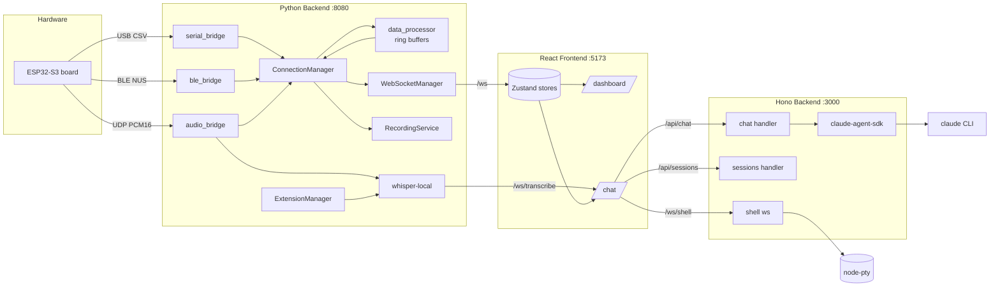
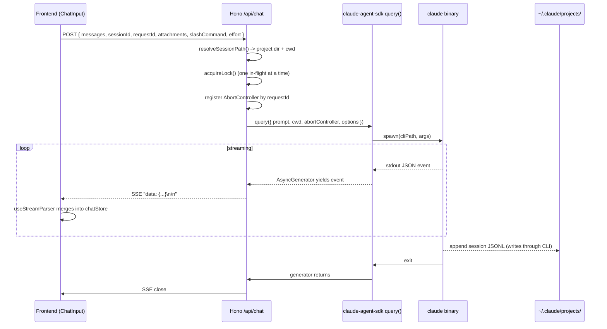
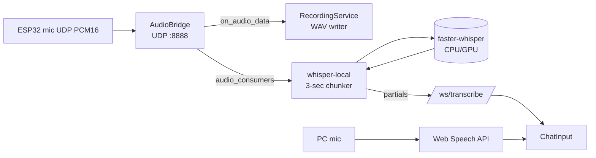
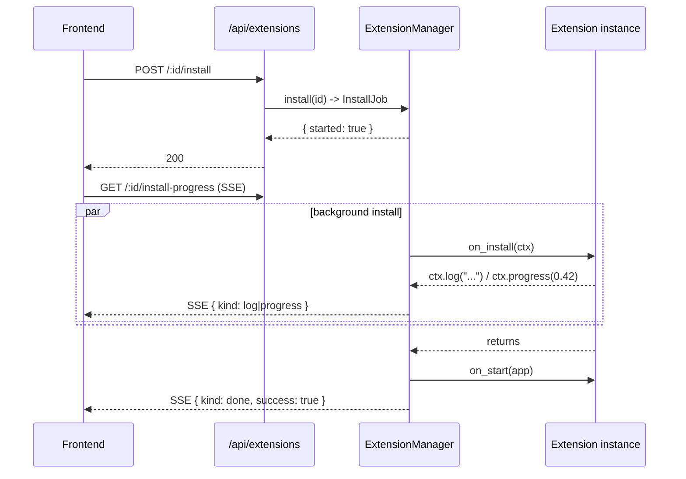
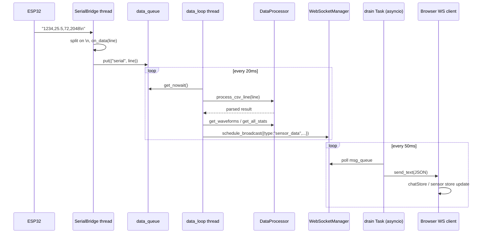
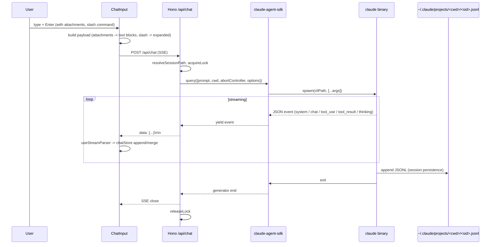
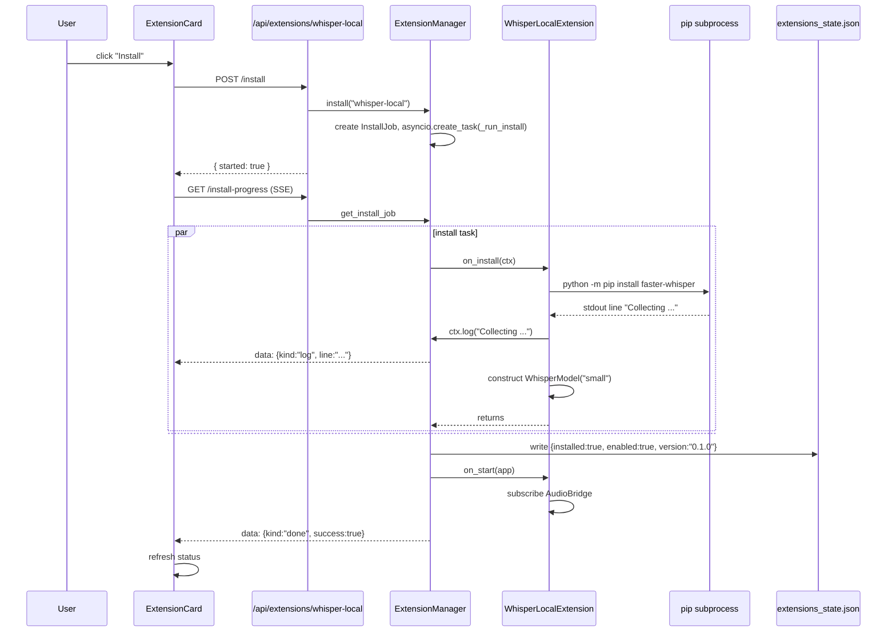

# AinOne Dashboard — Architecture

A deep technical dive into how AinOne Dashboard's three tiers cooperate. Read this alongside the source — it does not duplicate code, only the reasoning that holds the system together.

## 1. System Overview

AinOne Dashboard is a three-tier local-first application:

1. **Python FastAPI backend (`backend/app/`, port 8080)** — owns all hardware I/O. Reads ESP32 data over Serial / BLE / UDP, processes it through ring buffers and statistics, and fans it out to every connected browser over WebSocket. Also hosts the recordings library and the extension system.
2. **Node.js Hono backend (`backend/claude/`, port 3000)** — wraps the Claude Code CLI. Streams chat responses via SSE, manages conversation history under `~/.claude/projects/`, persists project sessions, and exposes a real PTY (xterm.js compatible) for the embedded terminal.
3. **React + Vite frontend (`frontend/`, port 5173)** — single-page app with two routes (`/dashboard`, `/chat`) and a shared header. Uses Zustand for state, Recharts for waveforms, xterm.js for the terminal, and the Web Speech API plus a backend-driven Whisper stream for voice input. Vite's dev proxy unifies the two backends behind a single origin.



## 2. Data Acquisition Layer

### Bridges

Each bridge encapsulates one transport and exposes the same callback contract: `on_data(line: str)` (or `on_data_update(values, raw_text)` for BLE which delivers parsed numeric arrays) plus `on_connection_change(connected, ...)`.

- **`SerialBridge`** (`backend/app/core/serial_bridge.py`)
  Wraps `pyserial`. A daemon `SerialRead` thread polls `serial_port.in_waiting`, accumulates a UTF-8 buffer, splits on `\n`, and pushes one line per call to `on_data`. Reconnect-safe: `disconnect()` joins the thread and closes the port.

- **`BLEBridge`** (`backend/app/core/ble_bridge.py`)
  Spawns a daemon thread that owns its own asyncio event loop (with the Windows `WindowsSelectorEventLoopPolicy` patched in for compatibility). Scans for the configured device name, subscribes to the Nordic UART TX characteristic via `bleak`, and parses each notification as CSV text. Reconnects on drop with a 2-second backoff.

- **`AudioBridge`** (`backend/app/core/audio_bridge.py`)
  UDP datagram socket on port 8888. Reads raw bytes, accumulates them in a `bytearray`, and slices into 256-byte (128-sample @ 16-bit) chunks. For each chunk it computes RMS / peak in dBFS via numpy, fires `on_audio_data` (used by the recording service) and broadcasts to a separate `_audio_consumers` list (used by the Whisper extension). Errors in one consumer never starve the others.

### Data processing

`DataProcessor` (`backend/app/core/data_processor.py`) is a header-aware CSV parser plus per-channel `ChannelProcessor`s. Each channel owns:

- A `RingBuffer` (`collections.deque(maxlen=N)`) for the waveform tail (default 100 points, configurable per session).
- Min / max / sum / count for stats.
- A `threading.Lock` (channels are written from the data thread and read by both the broadcaster and HTTP handlers).

Header detection is heuristic: if fewer than 50 % of the first row's tokens parse as floats, the row is treated as a header. If a later row arrives with more columns than currently registered (capped at `MAX_CHANNELS = 16`), the channel list grows in place — handy when a serial cold-start truncates the very first packet.

`reset()` is called on every disconnect so a stale narrow first packet from the last session can't lock the channel count for the lifetime of the process.

### ConnectionManager and WebSocket fan-out

`ConnectionManager` is the orchestrator (`backend/app/services/connection_manager.py`). It owns the three bridges, the data processor, and the recording service. On startup, it:

1. Wires bridge callbacks to two `queue.Queue`s — `_data_queue` for raw CSV strings, `_broadcast_queue` for connection / audio-level / recording-status notifications.
2. Spawns a daemon `_data_loop` thread that ticks at ~50 Hz: drains the data queue (parse + broadcast sensor frame), drains the broadcast queue (status updates), and emits a heartbeat recording-status frame every second.

Every broadcast lands in `WebSocketManager.schedule_broadcast(message)`, which is a thread-safe enqueue (`queue.put_nowait`). On the asyncio side, a single Task spawned in the FastAPI lifespan polls that queue every 50 ms and `await`s `connection.send_text(json.dumps(...))` against every active client with a 1-second per-client timeout. Slow / dead clients are evicted on the spot.

Why this design: pure thread → asyncio handoff via a queue, no `call_soon_threadsafe` or `run_in_executor`. Polling 50 ms gives at most 50 ms latency on top of the data tick, which is invisible at the 50 Hz sensor rate.

## 3. Frontend

### Routing & shells

`App.tsx` wraps `BrowserRouter` around three routes: `/dashboard` (default), `/chat`, `/settings`. The dashboard is a fixed two-column layout (sidebar with connection / recording / audio / display controls, main area with `ChannelGrid`). The chat page is a three-column layout (project sidebar, message list, recordings drawer) with a sticky composer at the bottom.

### State

Two Zustand stores under `frontend/src/store/`:

- **`index.ts`** — sensor & UI state. Holds connection booleans, channel array (with name, value, waveform, color, enabled), recording flags, display settings (`points_per_channel`, `cards_per_row`, `card_scale`, `wheel_zoom_sensitivity`).
- **`chatStore.ts`** — chat state. Discriminated-union `Message` type covering `chat`, `system`, `tool`, `tool_result`, `thinking`, plus pending attachments (`PendingAttachment`) and an event-id accumulator for stream parsing.

### API surface

`frontend/src/api/`:

- `client.ts` — thin `fetch` wrapper for the Python REST endpoints.
- `websocket.ts` — singleton `WebSocketClient` class with handler set, auto-reconnect, and message routing into the store.
- `claudeApi.ts` — fetch + SSE consumer for `/api/chat` (Hono backend) plus session / project CRUD.
- `recordingsApi.ts` — recordings library client.
- `extensionsApi.ts` — extension list / install (with SSE progress) / enable / disable / uninstall.

### Key components

- `channels/` — `ChannelGrid`, `ChannelCard` (one card per channel), `WaveformChart` (Recharts line chart with custom zoom/pan).
- `chat/` — `ChatPage` is the orchestrator; `ChatSidebar` lists projects/sessions; `ChatMessages` renders the discriminated union of message kinds; `ChatInput` is the composer with slash command, attachment, and voice tools; `RecordingsPanel` lists saved sensor sessions and supports drag-and-drop into the input.
- `shell/EmbeddedTerminal.tsx` — xterm.js terminal that opens a `WebSocket` to `/ws/shell`, exchanges JSON-framed init / input / output / resize / exit messages with the Hono PTY handler. Uses `@xterm/addon-fit` for resize and `@xterm/addon-web-links` for click-to-open.
- `settings/` — `SettingsPage` lists extensions (`ExtensionCard`) and display preferences (`DisplaySettings`).

### Voice input pipeline

`frontend/src/lib/speechRecognition.ts` abstracts two paths:

1. **PC mic** — Web Speech API (`window.SpeechRecognition`). Browser does the work; emits final + interim transcripts.
2. **ESP32 mic** — opens `ws://localhost:8080/ws/transcribe?lang=...`. The Whisper-local extension on the backend chunks UDP audio every 3 s and pushes back `{kind: 'partial', text: '...'}` events.

The component swaps between the two based on user choice; both feed the same composer.

## 4. AI Chat Subsystem

### Hono backend layout

`backend/claude/`:

- `app.ts` builds the Hono app and registers routes.
- `cli/node.ts` is the entry point: parses CLI args, validates the Claude binary, instantiates `NodeRuntime`, and attaches the shell WebSocket via `attachShellWebSocket(server)`.
- `runtime/{node,deno}.ts` — runtime adapters (Node is the only one wired up by default).
- `handlers/` — one file per concern:
  - `projects.ts` — list `~/.claude/projects/` directories.
  - `histories.ts` / `conversations.ts` — list / read JSONL session transcripts.
  - `chat.ts` — the heart: spawns Claude via `query()` from `@anthropic-ai/claude-agent-sdk`, streams events back as SSE, registers `AbortController`s by request id.
  - `abort.ts` — POST `/api/abort/:requestId` triggers the AbortController.
  - `sessions.ts` — session CRUD, project create/delete, folder/file pickers, slash-command discovery.
  - `shell.ts` — embedded terminal PTY over WebSocket.
- `middleware/config.ts` — injects `{ debugMode, runtime, cliPath }` into every request context.

### Chat round-trip



Conversation persistence is owned by the Claude CLI itself — sessions are JSONL files under `~/.claude/projects/<encoded-cwd>/<sessionId>.jsonl`. The Hono backend never writes them; it only reads them for history listings and re-resolves the correct `cwd` when resuming an existing session (see `resolveSessionPath` in `chat.ts`).

### Abort handling

Each chat request carries a client-supplied `requestId`. The chat handler creates an `AbortController` and stores it in a shared map. POST `/api/abort/:requestId` aborts the controller, which both the SDK's `AsyncGenerator` and `child_process.spawn` honor — the CLI is killed, and the SSE stream is closed cleanly with a `system { subtype: 'abort' }` event.

### Slash commands

`backend/claude/handlers/sessions.ts` implements `/api/slash-commands` (discovery — scans built-ins plus `~/.claude/commands/`) and `/api/slash-commands/expand` (transforms `/foo arg1 arg2` into the prompt the CLI will see). The frontend `frontend/src/lib/slashCommands.ts` mirrors the same logic for autocomplete.

### File attachments

`frontend/src/lib/attachments.ts` packages files (images via base64, code/text via plain string, recordings via metadata pointer) into the chat payload. The Hono handler unwraps them and prepends formatted blocks (`<file path="...">...</file>`) into the prompt before forwarding to the SDK. Drag-and-drop a saved recording from the chat sidebar — it becomes a structured attachment with the recording's id, channels, duration, and CSV preview.

### MCP servers

`backend/claude/handlers/chat.ts` has an opt-in MCP slot for the MiniMax MCP server. Set `MINIMAX_API_KEY` in the environment (or in `~/.claude/settings.json`) to enable it; without a key, no MCP servers are registered for the chat session.

## 5. Audio Pipeline



Two audio sources, one composer:

- **PC mic** stays entirely in the browser via the Web Speech API. Zero backend cost. Best when the user is at the keyboard.
- **ESP32 mic** streams 16 kHz mono PCM16 over UDP. The audio bridge decodes RMS / peak (used by the dashboard's level meter) AND fans frames out to subscribers. The Whisper-local extension subscribes, accumulates 3 s buffers, gates on a -55 dBFS silence threshold, normalises to -3 dBFS peak, and runs `faster-whisper` with `beam_size=5` on the model selected at install (default: `small`, ~490 MB).

Recording capture (`RecordingService.write_audio_frame`) accumulates raw frames in memory and writes a single WAV (mono, 16-bit, 16 kHz) when the session stops. Sensor CSV is flushed per row.

## 6. Recording System

A "session" is identified by a `YYYYMMDD_HHMMSS` timestamp. Each session may have:

- `recordings/csv/sensor_<ts>.csv` — header row plus one row per sensor tick.
- `recordings/audio/audio_<ts>.wav` — mono 16-bit 16 kHz WAV, written on stop.

Indexing (`backend/app/api/recordings.py`) is on demand: list the directory, regex-match the filenames, pair by timestamp. Filenames are whitelisted by regex on every request — eliminates path traversal without a separate sandbox check. Metadata for a session includes channel names (extracted from the CSV header), row count, file sizes, and WAV duration.

The chat sidebar's `RecordingsPanel` consumes `/api/recordings/list` and lets the user:

- Preview the CSV (first N rows via the `?head=` query parameter).
- Play the WAV (HTML5 `<audio>`).
- Drag-and-drop a session into the chat composer — it becomes a structured attachment with channel summary that Claude can analyse.

## 7. Extension System

```
backend/app/extensions/
├── base.py          # Extension + InstallContext abstract classes
├── registry.py      # Hardcoded list of extension classes
├── state.py         # extensions_state.json read/write (atomic)
├── manager.py       # ExtensionManager singleton + InstallJob
└── whisper_local.py # The reference extension
```

### Lifecycle

`install` → `enable` → `start` → `stop` → `disable` → `uninstall`. `install` is async and idempotent. `start` is called on every backend boot for every enabled extension (via the FastAPI lifespan).



State (installed / enabled / installed_at / version / config / last_error) is persisted as JSON. Writes go through a tmp-file + `replace()` to avoid half-written files if the process is killed mid-save.

`uninstall` is intentionally soft: the manager flips `installed=false` but does NOT `pip uninstall` — the package cache stays warm for fast reinstalls and we avoid breaking shared site-packages.

The `whisper-local` extension demonstrates the contract:

- `on_install` shells out to `python -m pip install faster-whisper`, line-piping output to the SSE stream.
- `on_start` lazy-imports faster-whisper, constructs a singleton `WhisperModel`, and subscribes to the `AudioBridge`'s consumer list.
- `on_stop` removes the audio subscription and drops the model reference.
- The extension also owns the `/ws/transcribe` WebSocket clients so when the user opens the chat's "ESP32 mic" toggle, the clients receive partials directly.

## 8. Concurrency & Threading model

| Component | Mechanism | Why |
|-----------|-----------|-----|
| FastAPI app | Single asyncio loop owned by uvicorn | Standard FastAPI pattern. |
| Serial reader | OS thread (daemon) | `pyserial` is blocking; cannot bridge to asyncio cleanly on Windows. |
| BLE reader | OS thread + dedicated asyncio loop inside the thread | `bleak` is async; we want it isolated from the FastAPI loop to avoid Windows event-loop policy clashes. |
| Audio reader | OS thread (daemon) | UDP `recvfrom` with timeout; trivial to join on shutdown. |
| Data loop | OS thread (`_data_loop` in `ConnectionManager`) | Polls two queues at 50 Hz, calls `WebSocketManager.schedule_broadcast`. |
| WS broadcast | Single asyncio Task on the main loop (`_queue_drain_task`) | Polls the cross-thread queue; `await` send to every client. |
| Chat backend | Node single-thread event loop + `child_process.spawn` for Claude | Claude SDK handles backpressure via async iterators. |
| Shell | `node-pty` IPty handle, `ws` WebSocket | Bidirectional byte stream; one PTY per connection, no multiplexing. |
| Whisper inference | Background thread per chunk inside the extension | Keeps the audio reader thread responsive. |

The single hard rule: hardware threads never call asyncio APIs directly. They enqueue, and the asyncio loop drains.

## 9. Build & Deploy

### Development

- Python: `python -u run.py` — uvicorn with no reload (so threads don't restart unpredictably). The frontend's Vite proxy forwards `/api/serial`, `/api/ble`, `/api/audio`, `/api/recording`, `/api/recordings`, `/api/extensions`, and `/ws` to port 8080. Chat-related routes (`/api/chat`, `/api/projects`, `/api/sessions`, `/api/abort`, `/api/system`, `/api/slash-commands`) and `/ws/shell` go to port 3000.
- Node: `npm run dev` runs `tsx watch cli/node.ts --debug`, which auto-reloads on TS changes.
- Frontend: `npm run dev` runs Vite with HMR.

### Production

- **Frontend:** `npm run build` (`tsc && vite build`) emits `frontend/dist/`. Serve with any static host (Nginx, Caddy) or let the Hono backend serve it via `staticPath` in `createApp`.
- **Hono backend:** `npm run build` cleans `dist/`, runs `scripts/build-bundle.js` (esbuild), and `scripts/copy-frontend.js`. The result is a single bundled CLI under `dist/cli/node.js`. `package.json` exposes it as the `ainone-claude-backend` bin.
- **Python backend:** No bundle step. Run via `uvicorn app.main:app` behind a reverse proxy. WebSocket support is required — websockets ≥ 12.

For a single-host deployment, run the Python backend on 8080, the Hono backend on 3000 with `--static-path` pointing at the built frontend, and put a reverse proxy in front to merge both origins under one domain.

## 10. Sequence diagrams

### (a) Sensor data tick



### (b) Chat message round-trip



### (c) Extension install


