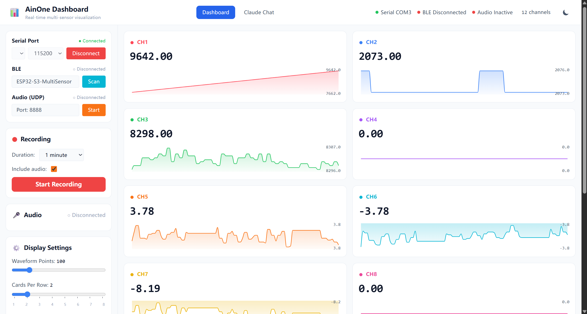
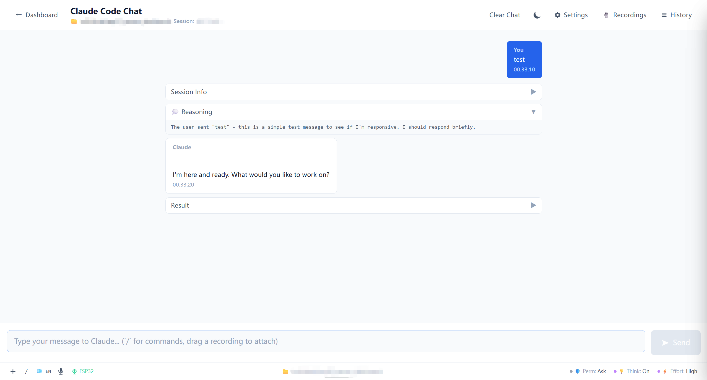
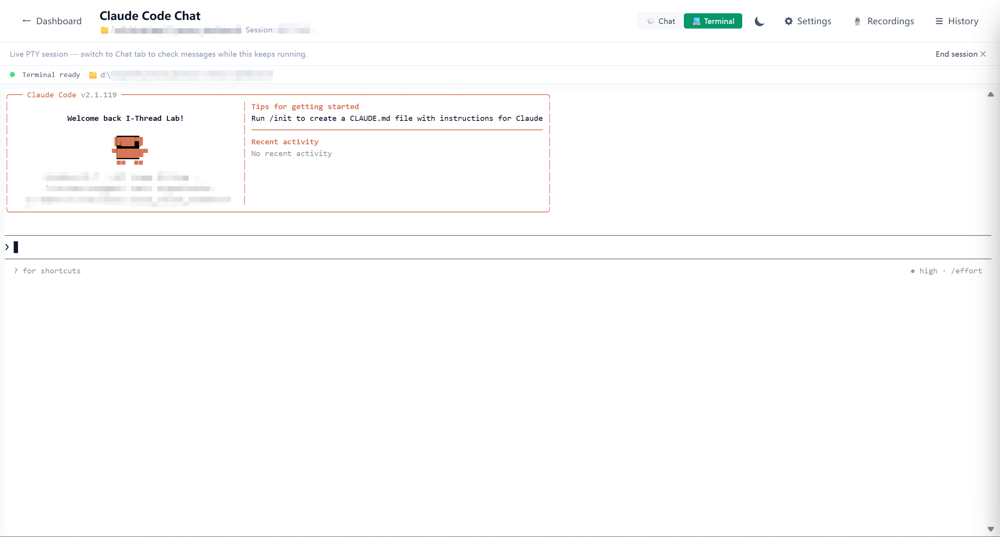

# AinOne Dashboard

A real-time multi-sensor dashboard for ESP32 hardware with built-in AI chat powered by Claude Code.

[](LICENSE)
[](https://www.python.org/)
[](https://nodejs.org/)
[](https://react.dev/)
[](https://fastapi.tiangolo.com/)

AinOne Dashboard streams data from an ESP32-S3 multi-sensor board over USB serial, BLE (Nordic UART), or WiFi UDP, visualises every channel as a live waveform in the browser, and lets you talk to the data through an embedded Claude Code chat — complete with slash commands, file attachments, voice dictation, and a real PTY-backed terminal.

> **Heads up — Claude Code CLI is required for the AI chat tier.** Install it from the official Anthropic repo at <https://github.com/anthropics/claude-code> (or follow the [quickstart](https://docs.claude.com/en/docs/claude-code/quickstart)) **before** starting the Hono backend. The sensor dashboard works without it, but `/chat` will not.

## Table of contents

- [Screenshots](#screenshots)
- [Features](#features)
- [Architecture overview](#architecture-overview)
- [Prerequisites](#prerequisites)
- [Quick Start](#quick-start)
  - [1. Install the Claude Code CLI](#1-install-the-claude-code-cli)
  - [2. Clone](#2-clone)
  - [3. One-shot launch (recommended)](#3-one-shot-launch-recommended)
  - [4. Manual setup (advanced / for development)](#4-manual-setup-advanced--for-development)
  - [5. Connect your ESP32](#5-connect-your-esp32)
- [ESP32 firmware data format](#esp32-firmware-data-format)
- [Configuration](#configuration)
- [API & WebSocket](#api--websocket)
- [Project Structure](#project-structure)
- [Extension system](#extension-system)
- [Recording & playback](#recording--playback)
- [Troubleshooting](#troubleshooting)
- [License](#license)
- [Acknowledgements](#acknowledgements)

## Screenshots



*Real-time multi-channel waveform view. Each channel is auto-detected from the CSV stream and rendered with min/max/avg statistics.*



*Claude Code chat with project sidebar, slash commands, drag-and-drop attachments, and dual voice input (PC mic or ESP32 UDP mic with local Whisper transcription).*



*xterm.js terminal backed by a real PTY on the Hono backend. Run any shell command alongside the chat.*

## Features

- **Multi-transport ingestion** — USB serial, BLE (Nordic UART Service), and WiFi UDP all converge on the same WebSocket fan-out.
- **Auto-detected channels** — drop any CSV stream (with or without a header) and channels are inferred automatically, up to 16.
- **Live waveform UI** — Recharts-based per-channel cards with zoom, pan, color-coded series, and configurable points-per-channel.
- **AI chat with Claude Code** — full streaming chat, conversation history, project sidebar, slash commands, abort, and effort/thinking controls.
- **Embedded terminal** — xterm.js + node-pty, multiplexed over WebSocket, scoped to your project's working directory.
- **Dual voice input** — PC microphone (Web Speech API) or on-device ESP32 UDP mic transcribed locally via Whisper.
- **Recording library** — capture sensor sessions to CSV and audio to WAV; browse and replay them; drag any saved recording into chat as context.
- **Pluggable extensions** — the Whisper-local extension installs itself in one click; the registry is designed for easy expansion.
- **Local-first** — every component runs on `localhost`. No data leaves your machine unless you explicitly route Claude through the cloud.

## Architecture overview

```
+------------+      Serial / BLE / UDP     +-----------------------+
|   ESP32    | --------------------------> |  Python FastAPI       |
|   board    |                             |  (port 8080)          |
+------------+                             |  serial/ble/audio     |
                                           |  bridges -> broadcaster|
                                           +-----------+-----------+
                                                       | WebSocket /ws
                                                       v
+------------------------+               +-----------------------+
|  React + Vite frontend |  REST + WS    |  Browser dashboard    |
|     (port 5173)        | <-----------> |  (Zustand, Recharts)  |
+-----------+------------+               +-----------+-----------+
            | /api/chat, /ws/shell                   |
            v                                        |
+-----------------------+    spawn / stream  +-------+--------+
|  Node.js Hono backend | -----------------> | Claude Code CLI|
|     (port 3000)       |                    | (claude binary)|
+-----------------------+                    +----------------+
```

| Tier | Stack | Port | Purpose |
|------|-------|------|---------|
| Sensor backend | Python 3.10+, FastAPI, uvicorn, pyserial, bleak, numpy | 8080 | Hardware I/O, ring-buffered data processing, WebSocket fan-out, recordings, extension host |
| AI backend | Node.js 20+, Hono, `@anthropic-ai/claude-agent-sdk`, node-pty, ws | 3000 | Claude Code subprocess management, streaming SSE, embedded shell |
| Frontend | React 18, TypeScript, Vite 5, Tailwind 3, Zustand, Recharts, xterm.js | 5173 | Single-page app, two routes: `/dashboard` and `/chat` |

For a deeper dive into the data flow, threading model, and subsystem boundaries, see [ARCHITECTURE.md](ARCHITECTURE.md).

## Prerequisites

- **Python ≥ 3.10**
- **Node.js ≥ 20**, npm ≥ 10
- **[Claude Code CLI](https://github.com/anthropics/claude-code)** — required for the AI chat tier. Install from the [official Anthropic repo](https://github.com/anthropics/claude-code) or via `npm i -g @anthropic-ai/claude-code`. The Hono backend probes the standard Anthropic install locations automatically; if your CLI lives elsewhere, set `CLAUDE_CLI_PATH=/abs/path/to/claude`.
- **ESP32-S3 board** (or any device that emits CSV over Serial / BLE NUS / UDP).
- *Optional* — `faster-whisper` for the on-device speech-to-text extension. The dashboard installs it for you with one click via Settings → Extensions.

> The Bluetooth backend uses `bleak`. On Linux it requires BlueZ ≥ 5.43. On macOS, grant the terminal Bluetooth permission. On Windows 10+, BLE works out of the box.

## Quick Start

> **TL;DR**
> 1. Install [Claude Code CLI](https://github.com/anthropics/claude-code) — `npm install -g @anthropic-ai/claude-code`, then `claude --version` to verify.
> 2. `git clone https://github.com/CZ114/ainone-dashboard.git && cd ainone-dashboard`
> 3. **Windows:** double-click `start.bat`. **macOS / Linux:** `./start.sh`.
> 4. Open <http://localhost:5173>. First launch takes a minute or two while it auto-installs `backend/.venv`, `backend/claude/node_modules`, and `frontend/node_modules`. Subsequent launches are instant.

### 1. Install the Claude Code CLI

Required before the Hono backend will work — without it, `/chat` won't function (the sensor dashboard still does).

```bash
# Recommended — installs the official Anthropic CLI globally
npm install -g @anthropic-ai/claude-code

# Verify
claude --version
```

If you'd rather install from source or use the vendored installer, follow the upstream instructions at <https://github.com/anthropics/claude-code> and the [quickstart guide](https://docs.claude.com/en/docs/claude-code/quickstart). On the first run, `claude` will walk you through authentication (Anthropic API key or Claude Pro / Team account).

If your `claude` binary is not on `PATH`, point the Hono backend at it explicitly:

```bash
export CLAUDE_CLI_PATH=/abs/path/to/claude   # macOS / Linux
$env:CLAUDE_CLI_PATH = "C:\path\to\claude.exe"   # Windows PowerShell
```

### 2. Clone

```bash
git clone https://github.com/CZ114/ainone-dashboard.git
cd ainone-dashboard
```

### 3. One-shot launch (recommended)

Both helper scripts are **self-installing** — on first run they create `backend/.venv`, run `pip install -r requirements.txt`, and `npm install` for both Node tiers, then boot all three servers. On subsequent runs, the install steps are skipped and start-up is instant.

- **Windows** — double-click `start.bat` (or run it from `cmd`). Opens three console windows, one per tier.
- **macOS / Linux** — `./start.sh` from the repo root. Boots all three tiers; `Ctrl+C` in the launching terminal shuts everything down.

When all three windows show their respective banners (`Uvicorn running on ...`, `Listening on http://127.0.0.1:3000`, `VITE ready`), open <http://localhost:5173>.

### 4. Manual setup (advanced / for development)

Skip this section if `start.bat` / `start.sh` worked. Three terminals, one per tier.

<details>
<summary><b>4a. Python backend (port 8080)</b></summary>

**macOS / Linux:**

```bash
cd backend
python3 -m venv .venv
source .venv/bin/activate
pip install -r requirements.txt
python -u run.py
```

**Windows (cmd):**

```bat
cd backend
python -m venv .venv
.venv\Scripts\activate
pip install -r requirements.txt
python -u run.py
```

**Windows (PowerShell):**

```powershell
cd backend
python -m venv .venv
.\.venv\Scripts\Activate.ps1
pip install -r requirements.txt
python -u run.py
```

</details>

<details>
<summary><b>4b. Claude (Hono) backend (port 3000)</b></summary>

```bash
cd backend/claude
npm install
node scripts/generate-version.js
npm run dev
```

`generate-version.js` writes `cli/version.ts` from `package.json` — required before the first run. If the backend logs `claude binary not found`, revisit step 1 or set `CLAUDE_CLI_PATH`.

</details>

<details>
<summary><b>4c. Frontend (port 5173)</b></summary>

```bash
cd frontend
npm install
npm run dev
```

Open <http://localhost:5173>. Vite proxies all backend API calls automatically (see `frontend/vite.config.ts`).

</details>

### 5. Connect your ESP32

| Transport | How |
|-----------|-----|
| **USB Serial** | Plug in, click `Refresh` in the left panel, pick the COM port, set baud (default 115200), click `Connect`. |
| **BLE** | Click `Connect BLE`. The backend scans for `ESP32-S3-MultiSensor` exposing the Nordic UART Service (`6E400001-…`). Auto-reconnects on drop. |
| **WiFi UDP audio** | Click `Start Audio` (default port 8888). The ESP32 should send 16 kHz mono PCM16 frames to the host's UDP `:8888`. |

Sensor data appears in the dashboard as soon as it arrives.

## ESP32 firmware data format

The data processor accepts CSV — header row optional, comma-separated, one sample per line.

```csv
# Recommended (header on first line)
timestamp,temp,hr,gsr,ax
0,25.5,72,2048,0.52
1,25.6,72,2050,0.51

# Without header (channels become CH1, CH2, ...)
0,25.5,72,2048,0.52
```

- Up to 16 channels (`MAX_CHANNELS` in `backend/app/config.py`).
- Numeric tokens are auto-detected; non-numeric fields fall back to 0.0.
- Channel count grows on the fly if a wider row arrives later in a session.

For UDP audio, send raw 16 kHz mono PCM16 frames to UDP `0.0.0.0:8888` on the host.

## Configuration

Most defaults live in `backend/app/config.py`:

| Constant | Default | What |
|----------|---------|------|
| `DEFAULT_BAUD_RATE` | 115200 | Serial baud |
| `BLE_DEVICE_NAME` | `ESP32-S3-MultiSensor` | BLE scan target |
| `BLE_SERVICE_UUID` / `BLE_CHAR_TX_UUID` | Nordic UART | NUS UUIDs |
| `AUDIO_DEFAULT_PORT` | 8888 | UDP audio port |
| `AUDIO_SAMPLE_RATE` | 16000 | Hz |
| `DEFAULT_WAVEFORM_POINTS` | 100 | Ring-buffer length per channel |
| `MAX_CHANNELS` | 16 | Hard cap |

Recordings land in `recordings/csv/` and `recordings/audio/` at the project root.

The Hono backend reads `~/.claude/settings.json` for environment variables (e.g. `ANTHROPIC_API_KEY`, custom base URL). Set `CLAUDE_CLI_PATH` to override the CLI auto-detection. See `.env.example` for all supported variables.

## API & WebSocket

Once the Python backend is running:

- Swagger UI: <http://localhost:8080/docs>
- ReDoc: <http://localhost:8080/redoc>
- Health: <http://localhost:8080/api/health>

| Group | Prefix |
|-------|--------|
| Serial | `/api/serial` (`/ports`, `/connect`, `/disconnect`, `/status`) |
| BLE | `/api/ble` (`/scan`, `/connect`, `/disconnect`, `/status`) |
| Audio | `/api/audio` (`/start`, `/stop`, `/status`) |
| Recording control | `/api/recording` (`/start`, `/stop`, `/status`) |
| Recording library | `/api/recordings` (`/list`, `/meta/{id}`, `/csv/{name}`, `/audio/{name}`) |
| Extensions | `/api/extensions` (list, install, install-progress SSE, enable, disable, uninstall) |

WebSocket endpoints:

- `ws://localhost:8080/ws` — sensor + connection + recording events
- `ws://localhost:8080/ws/transcribe?lang=en-US` — live Whisper partials (when extension enabled)
- `ws://localhost:3000/ws/shell` — embedded terminal PTY

Sensor frame example:

```json
{
  "type": "sensor_data",
  "timestamp": "2026-04-26T10:30:45.123Z",
  "channels": ["temp", "hr", "gsr", "ax"],
  "values": [25.6, 72, 2048, 0.523],
  "waveforms": [[25.1, 25.2], [70, 71]],
  "stats": { "min": [20.0, 70], "max": [30.0, 75], "avg": [25.5, 72.3] }
}
```

## Project Structure

```
ainone-dashboard/
├── backend/
│   ├── run.py                       # uvicorn entry point
│   ├── requirements.txt
│   ├── app/
│   │   ├── main.py                  # FastAPI app + lifespan
│   │   ├── config.py                # Constants / paths
│   │   ├── api/                     # REST routers
│   │   │   ├── serial.py  ble.py  audio.py
│   │   │   ├── recording.py  recordings.py
│   │   │   ├── extensions.py  websocket.py
│   │   ├── core/                    # Hardware bridges
│   │   │   ├── serial_bridge.py     # pyserial
│   │   │   ├── ble_bridge.py        # bleak
│   │   │   ├── audio_bridge.py      # UDP receiver
│   │   │   └── data_processor.py    # ring buffers + stats
│   │   ├── services/
│   │   │   ├── connection_manager.py
│   │   │   ├── websocket_manager.py
│   │   │   └── recording_service.py
│   │   ├── extensions/              # Pluggable extension system
│   │   │   ├── base.py  manager.py  registry.py  state.py
│   │   │   └── whisper_local.py
│   │   └── models/schemas.py        # Pydantic
│   ├── shared/types.ts              # Shared types between Hono and frontend
│   └── claude/                      # Node.js Hono backend
│       ├── app.ts                   # Hono routes
│       ├── cli/node.ts              # Entry point
│       ├── handlers/                # chat, sessions, projects, abort, shell
│       ├── runtime/                 # node / deno adapters
│       ├── middleware/  utils/  scripts/  tests/
│       └── package.json
├── frontend/
│   ├── src/
│   │   ├── App.tsx  main.tsx
│   │   ├── api/                     # client.ts, websocket.ts, claudeApi.ts, ...
│   │   ├── components/
│   │   │   ├── Dashboard.tsx
│   │   │   ├── channels/  audio/  recording/  layout/
│   │   │   ├── chat/                # ChatPage, ChatSidebar, ChatMessages, ...
│   │   │   ├── shell/               # EmbeddedTerminal.tsx
│   │   │   └── settings/            # SettingsPage, ExtensionCard
│   │   ├── store/                   # Zustand: index.ts, chatStore.ts
│   │   ├── lib/                     # slashCommands, attachments, speechRecognition
│   │   ├── hooks/  contexts/  types/
│   ├── vite.config.ts               # Dev proxy -> 8080 + 3000
│   └── package.json
├── docs/screenshots/                # Screenshots referenced in this README
├── start.bat  start.sh
├── ARCHITECTURE.md
├── LICENSE
└── README.md
```

## Extension system

Extensions are plain Python classes implementing `app.extensions.base.Extension`. They:

1. Declare `id`, `name`, `description`, `version`.
2. Implement `on_install(ctx)` — installs deps, downloads weights, etc. Streams logs/progress to the UI via SSE.
3. Optionally implement `on_start(app)` / `on_stop()` to register routes or subscribe to bridges.

State (installed / enabled / config) is persisted to `extensions_state.json`. Install with one click from **Settings → Extensions** in the UI; the manager runs the install in the background and streams output to the card.

The reference extension is `whisper-local` — installs `faster-whisper`, downloads model weights, subscribes to UDP audio frames, and exposes `/ws/transcribe` for live captions in the chat input.

## Recording & playback

- Click **Record** on the dashboard to start a session. Choose duration and whether to include audio.
- The Python backend writes:
  - `recordings/csv/sensor_YYYYMMDD_HHMMSS.csv`
  - `recordings/audio/audio_YYYYMMDD_HHMMSS.wav`
- The chat page's **Recordings** panel lists all sessions, lets you preview the CSV / play the WAV, and drag-and-drop a recording into the chat input — it gets attached as context for Claude.

## Troubleshooting

| Symptom | Fix |
|---------|-----|
| `ModuleNotFoundError: No module named 'uvicorn'` | The Python venv isn't active or `pip install -r requirements.txt` was never run. Either re-do step 3 of [Quick Start](#3-python-backend-port-8080) inside `backend/`, or use `start.bat` / `start.sh` which auto-installs on first run. |
| `'tsx' 不是内部或外部命令` / `tsx: command not found` | `node_modules` hasn't been installed in `backend/claude/`. Run `cd backend/claude && npm install` (then `node scripts/generate-version.js && npm run dev`). |
| `Address already in use` on 8080 / 3000 / 5173 | Another process is bound. `lsof -i :8080` (mac/linux) or `netstat -ano \| findstr :8080` (Windows). Kill it or change the port. |
| Cannot open COM port (Windows) | Close any other serial monitor (Arduino IDE, PuTTY). On Linux/macOS add yourself to `dialout` / `tty` groups: `sudo usermod -aG dialout $USER`. |
| BLE never finds the device | Make sure the ESP32 is advertising as `ESP32-S3-MultiSensor`. On Linux, run the backend with `sudo` once or grant the `bluetooth` capability. |
| Claude backend says `claude binary not found` | Install the CLI (`npm i -g @anthropic-ai/claude-code` or vendor installer) and ensure it's on PATH, or set `CLAUDE_CLI_PATH=/abs/path/to/claude`. |
| WebSocket keeps disconnecting | The Python backend has a 1-second per-broadcast timeout. Heavy CPU contention can trigger drops. Run the backend with `python -u run.py` so logs flush, then check the console. |
| Whisper extension fails to install | `faster-whisper` needs a working `pip` and ~500 MB free for the `small` model. Re-run install from the card; logs stream live. |
| Frontend shows no data even when serial is connected | Check that the device is sending CSV (line-terminated). Look at the backend console for `[Serial] Received line:` traces. Disconnect/reconnect to reset the auto-detected channel list. |

## License

[MIT](LICENSE) © 2026 CZ114.

## Acknowledgements

Built on the shoulders of:

- [FastAPI](https://fastapi.tiangolo.com/), [uvicorn](https://www.uvicorn.org/), [pydantic](https://docs.pydantic.dev/), [pyserial](https://pyserial.readthedocs.io/), [bleak](https://bleak.readthedocs.io/), [numpy](https://numpy.org/)
- [Hono](https://hono.dev/), [`@anthropic-ai/claude-agent-sdk`](https://www.npmjs.com/package/@anthropic-ai/claude-agent-sdk), [node-pty](https://github.com/microsoft/node-pty), [ws](https://github.com/websockets/ws)
- [React](https://react.dev/), [Vite](https://vitejs.dev/), [Tailwind CSS](https://tailwindcss.com/), [Zustand](https://zustand-demo.pmnd.rs/), [Recharts](https://recharts.org/), [xterm.js](https://xtermjs.org/)
- [faster-whisper](https://github.com/SYSTRAN/faster-whisper) for on-device speech-to-text
- [Claude Code](https://github.com/anthropics/claude-code) — the official Anthropic CLI that powers the AI chat tier
