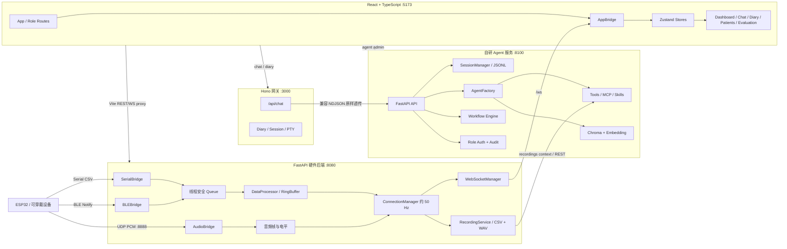

# 00｜这个项目到底在做什么

## 一句话版本

`AinOne Dashboard` 是一个面向可穿戴传感器和早期阿尔茨海默病研究场景的本地全栈平台：它接收 ESP32 的串口、BLE 和 UDP 音频数据，实时展示与录制多通道信号，并把录音、知识库、患者上下文和自研 Agent 工作流接入聊天、日记、随访与医生评估界面。

## 不是一个服务，而是四层运行栈

| 层 | 当前入口 | 端口 | 主要职责 | 当前证据状态 |
|---|---|---:|---|---|
| 设备/录音后端 | `backend/run.py` → `backend/app/main.py` | 8080 | Serial、BLE、UDP 音频、WebSocket、CSV/WAV、Whisper/TTS 扩展 | 已实现；硬件实机需运行验证 |
| Agent 服务 | `backend/agent_service/run.py` → `main.py` | 8100 | Agent 会话、模型路由、工具、审批、RAG、MCP、Skills、工作流、身份与审计 | 已实现；真实 LLM/RAG 需密钥和模型验证 |
| Agent 网关 | `backend/agent_gateway/cli/node.ts` → `app.ts` | 3000 | Hono API、兼容旧前端协议、流式透传、日记、PTY/项目历史 | 已实现；部分源于 `claude-code-webui` 后定制 |
| Web 前端 | `frontend/src/main.tsx` → `App.tsx` | 5173 | React 路由、角色界面、波形、录音、聊天、RAG/工作流管理、医生评估 | 已实现；缺少自动化前端测试 |

`start.bat` 启动旧 Claude Agent SDK 路线；`start_agent.bat` 启动当前自研四层路线。两条路线并存是迁移兼容策略，不应在面试中说成“只有一个 Node 后端”。

## 总体架构

## 数据链 1：ESP32 到波形页面

1. `SerialBridge`、`BLEBridge` 或 `AudioBridge` 在后台线程接收数据。
2. 串口/BLE 数据被放入 `ConnectionManager._data_queue`，避免硬件线程直接操作 asyncio/WebSocket。
3. `_data_loop()` 约每 20 ms 排空队列，调用 `DataProcessor.process_csv_line()`。
4. `DataProcessor` 自动识别表头、创建通道、把值放入线程安全 `RingBuffer`，同时累计 min/max/avg。
5. `ConnectionManager` 组装 `sensor_data`，通过 `WebSocketManager.schedule_broadcast()` 切回 FastAPI 事件循环。
6. 前端单例 `WebSocketClient` 收到 JSON，`AppBridge` 只保留最新高频帧，并用 `requestAnimationFrame` 把 React 更新限制到屏幕刷新节奏。
7. Zustand `updateSensorData()` 保留通道开关与颜色，`ChannelGrid`/图表组件完成渲染。

这条链最适合回答：线程与协程区别、生产者消费者、Ring Buffer、WebSocket、背压、React 高频渲染优化。

## 数据链 2：录音与回放

1. 前端调用 `/api/recording/start`，后端创建录制会话。
2. 传感器广播同时写 CSV，UDP PCM 帧同时写音频缓存。
3. 监控线程按时自动停止并落盘 WAV；状态通过 WebSocket 心跳通知前端。
4. 前端用“本地时钟为显示权威 + 后端心跳只做终止确认”的单锚点模型，避免倒计时来回跳。
5. 录音库可拉取 CSV/WAV、转写、附加到聊天，也可在 Dashboard 回放；回放期间 `AppBridge` 丢弃实时传感器帧，避免两个数据源争抢图表。

## 数据链 3：一次 Agent 聊天

1. React `claudeApi.sendMessage()` 向 Hono `/api/chat` 发请求。
2. `agent_gateway/handlers/chat.ts` 只转发自研服务理解的字段，并把浏览器断连信号传给上游。
3. Agent 服务 `/api/compat/chat` 为会话获取互斥锁，注册 `requestId` 与中止事件。
4. worker thread 同步执行 `agent.stream()`；事件通过 `queue.Queue` 送给 StreamingResponse 生成器。
5. `wire.py` 把内部 `text/tool_call/tool_result/permission/done` 转成旧 React 流解析器兼容的 NDJSON。
6. 高风险工具触发 `PermissionBroker`：工具线程等待 `threading.Event`，前端提交允许/拒绝后继续；超时默认拒绝。
7. 会话写入 `backend/data/agent_service/sessions/*.jsonl`，进程重启后可通过 `Agent.resume()` 恢复。

这条链最适合回答：流式 HTTP、NDJSON 分帧、线程与异步桥接、取消、幂等、会话锁、HITL 与工具安全。

## 数据链 4：RAG、MCP、Skills 与工作流

- `factory.py` 根据运行时配置或 `agents.json` 构建 Agent。
- Agent 可挂本地工具、MCP 工具源、文件 Skills 和 Chroma 检索工具。
- RAG 已有 collection、ingest、search 和 source replacement；旧 `backend/agent_service/README.md` 仍写“501 占位”，属于文档漂移。
- 工作流由外部实际导入的 `D:\Imperial\individual\AgentFramework_build\project\agent\orchestration\workflow.py` 执行，支持 `agent`、`loop`、`break_if`、`parallel`、`route`、`human`。
- `followup_review` 是平台内置种子流程：初评 → 知识检索/分析 → verifier 核验 → 最多三轮修订。
- `delegate` 工具仍是占位；不能把它描述成已完成的通用多 Agent 委派。

## 前端产品面

| 页面 | 用户价值 | 技术主线 |
|---|---|---|
| `/dashboard` | 设备连接、实时波形、录制、回放 | WebSocket、Zustand、rAF、Recharts |
| `/chat` | Agent 流式聊天、工具与审批、历史 | NDJSON、Abort、Markdown、PTY、会话状态 |
| `/diary` | 定时生成观察、回复与配置 | Scheduler、SSE/事件流、持久化 |
| `/patients` / `/today` | 医患分级视角与患者归属 | token、角色策略、数据级过滤 |
| `/settings` | 模型、Agents、RAG、MCP、Skills、Workflows | 管理 API、配置持久化、长任务状态 |
| `/doctor-evaluation` | 基于冻结病例合同的医生评估前端 | schema、adapter、研究数据边界 |

## 当前最重要的诚实边界

1. **运行事实不等于构建通过**：硬件、Whisper、真实模型和浏览器交互仍需各自验证。
2. **README 已落后于源码**：根架构说明仍主要描述三服务；Agent README 的 RAG 状态已经过时。
3. **两个网关目录并存**：`backend/claude` 是原 SDK 路线，`backend/agent_gateway` 是去 SDK 兼容网关。
4. **Agent 框架是外部 editable dependency**：当前 venv 实际导入 `D:\Imperial\individual\AgentFramework_build\project\agent`，项目不能脱离该目录独立复现。
5. **医疗功能是研究平台，不是医疗诊断系统**：代码中也有“不做医疗诊断”的系统提示和数据归属边界。
6. **直播归属是协调信号，不是访问控制**：`backend/app/api/live.py` 明确说明这一点。

## 建议的 3 分钟项目讲法

1. **场景**：可穿戴 ESP32 持续采集 PPG/IMU/音频，需要研究人员实时查看、录制并结合 AI 分析。
2. **架构**：四层本地栈；FastAPI 管硬件与录音，自研 FastAPI Agent 服务管智能体能力，Hono 做兼容网关，React 提供多角色界面。
3. **难点**：硬件线程到 asyncio 的桥接、高频波形渲染、流式 Agent 协议、工具审批与会话恢复、患者数据归属。
4. **取舍**：文件/JSONL 优先保证研究原型可审计；localhost 默认降低暴露面；兼容层让前端在 Agent SDK 迁移时保持稳定。
5. **不足**：测试、CI、可复现部署、跨服务可观测性和文档同步仍是下一阶段重点。
