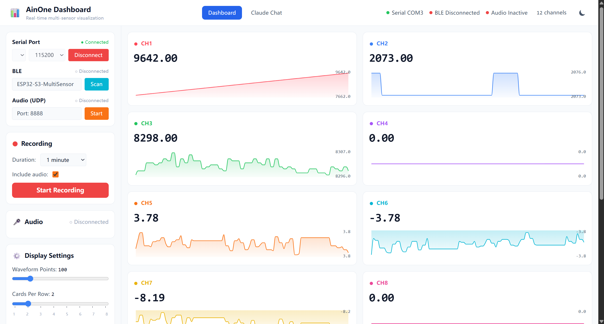
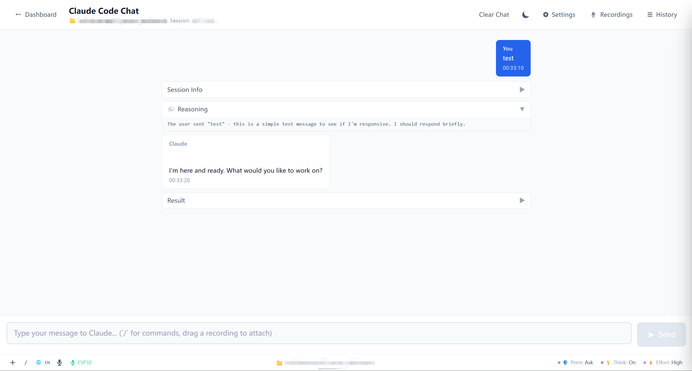
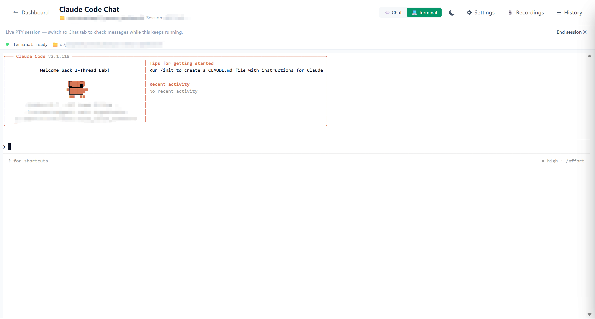

# AinOne Dashboard

A full-stack real-time sensor dashboard with AI chat integration, powered by ESP32, FastAPI, and Claude Code.

## Features

| Feature | Description |
|---------|-------------|
| **Real-time waveforms** | Multi-channel sensor data visualized live from ESP32 via Serial, BLE, or WiFi UDP |
| **AI Chat** | Claude Code CLI integration with slash commands, file attachments, thinking/effort/mode controls |
| **Dual voice input** | PC microphone (browser SpeechRecognition) or ESP32 UDP microphone (Whisper local inference) |
| **Session recordings** | Capture sensor sessions to CSV + WAV, drag recordings into chat as context |
| **Pluggable extensions** | Install backend extensions (e.g. Whisper) from the Settings UI |

## Hardware

- ESP32 or ESP32-S3 development board
- USB cable for serial flashing
- (Optional) Bluetooth-capable ESP32 for BLE

## Tech Stack

| Layer | Technology |
|-------|-----------|
| Python Backend | FastAPI · uvicorn · websockets · pydantic · pyserial · bleak · numpy |
| Node.js Backend | Hono · TypeScript · Claude Code SDK |
| Frontend | React 18 · TypeScript · Vite · Tailwind CSS · Zustand · recharts |

## Quick Start

### 1 — Backend

```bash
cd backend
python -m venv .venv
source .venv/bin/activate      # Windows: .venv\Scripts\activate
pip install -r requirements.txt
python -u run.py               # Backend on :8080
```

### 2 — Claude Backend

```bash
cd backend/claude
npm install
node scripts/generate-version.js
npm run dev                     # Backend on :3000
```

### 3 — Frontend

```bash
cd frontend
npm install
npm run dev                     # Frontend on :5173
```

Open `http://localhost:5173` — select **Dashboard** or **Chat** from the navigation.

## Architecture

```
┌──────────────────────────────────────────────────────────┐
│                     ESP32 Device                         │
│              (Serial USB / BLE / WiFi UDP)               │
└──────────────────┬───────────────────┬──────────────────┘
                   │ Serial            │ UDP Audio
                   ▼                   ▼
┌──────────────────────────────────────────────────────────┐
│          Python Backend (FastAPI) — Port 8080             │
│  SerialBridge  ·  BLEBridge  ·  AudioBridge             │
│  DataProcessor ·  WebSocketManager ·  RecordingService  │
│  Extensions (Whisper, ...)                                │
└──────────────────────────┬────────────────────────────────┘
                           │  REST API  ·  WebSocket /ws
                           ▼
┌──────────────────────────────────────────────────────────┐
│          Node.js Backend (Hono) — Port 3000              │
│  Claude Code SDK  ·  /api/chat (streaming NDJSON)         │
└──────────────────────────┬────────────────────────────────┘
                           │  via Vite proxy
                           ▼
┌──────────────────────────────────────────────────────────┐
│          React Frontend (Vite) — Port 5173              │
│  /dashboard  ·  /chat  ·  /settings                     │
└──────────────────────────────────────────────────────────┘
```

### Directory Structure

```
ainone-dashboard/
├── backend/
│   ├── app/
│   │   ├── api/          # REST routes: serial, ble, audio, recording, extensions
│   │   ├── core/         # Bridge modules: serial_bridge, ble_bridge, audio_bridge
│   │   ├── services/      # WebSocket manager, recording service
│   │   ├── models/       # Pydantic request/response schemas
│   │   ├── extensions/   # Pluggable extension system + Whisper
│   │   └── main.py       # FastAPI app + CORS + lifespan hooks
│   ├── claude/            # Node.js Hono backend (Claude Code SDK)
│   │   ├── handlers/      # chat, sessions, projects, abort handlers
│   │   ├── runtime/      # Node.js / Deno runtime abstraction
│   │   └── cli/          # CLI argument parsing + Claude CLI validation
│   ├── requirements.txt
│   └── run.py
├── frontend/
│   ├── src/
│   │   ├── api/          # REST clients + WebSocket client
│   │   ├── components/   # React components by feature
│   │   │   ├── channels/  # ChannelCard, ChannelGrid, WaveformChart
│   │   │   ├── chat/      # ChatPage, ChatInput, SlashCommandMenu, ...
│   │   │   ├── settings/  # SettingsPage, ExtensionCard, DisplaySettings
│   │   │   └── ...
│   │   ├── store/         # Zustand stores (app state, chat state)
│   │   └── lib/           # speechRecognition, attachments, slashCommands
│   ├── package.json
│   └── vite.config.ts     # Proxy: /api/* → :8080, /api/chat/* → :3000
└── README.md
```

## Screenshots

### Dashboard — Real-time Sensor Waveforms



Multi-channel waveform display with per-channel auto-scaling, wheel zoom, and double-click reset. Left sidebar controls Serial/BLE/UDP connections and recording. Right status bar shows connection state and active channel count.

### Chat — Claude Code Integration



Claude Code chat with collapsible reasoning/result panels, slash commands (`/clear`, `/compact`, `/cost`, `/help`, `/history`, `/new`, `/model`), file attachment pills, and status pills for permission mode, thinking, and effort level.

### Terminal — Live PTY Session



Live PTY terminal embedded in the chat view via node-pty + xterm.js. Switch between Chat and Terminal tabs. Status bar shows current session state and effort level.

## Key Features in Detail

### Connection Panel (Dashboard)

- **Serial**: select COM port + baud rate → Connect/Disconnect
- **BLE**: scan for nearby ESP32 devices → connect by name
- **UDP Audio**: start UDP listener on configurable port (default 8888)

### Recording Controls

- Set duration (1s – 3600s), toggle audio inclusion
- Writes `sensor_YYYYMMDD_HHMMSS.csv` with timestamp + all channel values
- Writes `audio_YYYYMMDD_HHMMSS.wav` (16-bit mono, 16 kHz) when audio is active

### Chat Input Toolbar

- **`+`** — attach files via OS picker (text files read inline; images/reports use path reference)
- **`/`** — slash command menu (7 built-in commands)
- **🌐** — voice language picker (9 BCP-47 languages)
- **🎤** — PC microphone (browser SpeechRecognition, continuous mode)
- **ESP32** — ESP32 UDP microphone (requires `whisper-local` extension)

### Voice Input

| Path | Source | Engine | Requirements |
|------|--------|--------|--------------|
| PC mic | Browser `webkitSpeechRecognition` | Google STT | Chrome/Edge |
| ESP32 mic | ESP32 → UDP :8888 → backend | faster-whisper `small` | `whisper-local` extension |

### Pluggable Extension System

1. Open **Settings → Extensions**
2. Click **Install** on any extension (e.g. `whisper-local`)
3. Backend auto-starts the extension on next boot
4. SSE progress stream shows install + runtime stats

### Display Settings

- **Card Size** slider: 0.6×–2.1× with magnetic snap at 0.7/0.85/1.0/1.25/1.5/2.0×
- **Wheel Zoom Step**: 2%–40% with snap at 5/10/15/20/30%
- Per-channel **double-click** resets that card to auto-scaling

## ESP32 Data Format

The dashboard parses CSV from ESP32:

```
# With header (recommended)
timestamp,ch1_temp,ch2_hr,ch3_gsr,ch4_ax
0,25.5,72,2048,0.52

# Without header: auto-named CH1, CH2, ...
0,25.5,72,2048,0.52
```

WiFi UDP Audio stream: 16-bit mono PCM, 16 kHz, sent to port 8888.

## Configuration

Copy `.env.example` to `.env` in the project root.

| Variable | Default | Description |
|----------|---------|-------------|
| `PORT` | 3000 | Claude backend HTTP port |
| `HOST` | 127.0.0.1 | Claude backend bind address |
| `CLAUDE_PATH` | auto | Path to Claude CLI executable |
| `DEBUG` | false | Enable debug mode logging |
| `SERIAL_BAUD_RATE` | 115200 | Serial baud rate |
| `BLE_DEVICE_NAME` | ESP32-S3-MultiSensor | BLE device name filter |
| `AUDIO_PORT` | 8888 | UDP audio listening port |

## Docker

```bash
docker-compose up --build
```

> Python backend requires `network_mode: host` for USB serial and BLE access. For local development, use `start.bat` / `start.sh` instead.

## License

MIT
